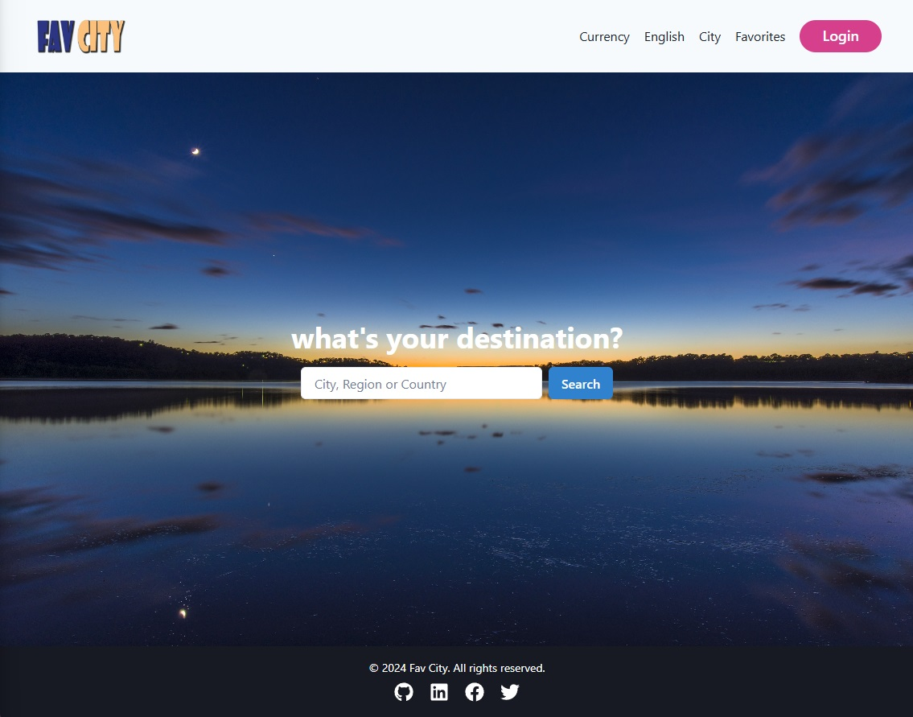

# Fav City - [https://fav-city.vercel.app/](https://fav-city.vercel.app/)



Fav City is a web-based travel application developed with Next.js and integrated with MongoDB. It allows users to explore various cities, add cities to favorites, customize settings, and access city-specific details such as language, currency, and popular destinations.

## Table of Contents

- [About the Project](#about-the-project)
- [Features](#features)
- [Installation](#installation)
- [Usage](#usage)
- [Technologies Used](#technologies-used)
- [Future Development](#future-development)

## About the Project

Fav City is designed to provide users with a seamless travel experience by allowing them to discover cities worldwide, save favorite locations, and customize preferences such as language and currency settings.

- Dynamic City Data: City data is dynamically loaded from MongoDB through API routes.
- Personalized Experience: Users can customize language, currency, and view city details.
- Favorites: Users can add cities to their favorites for easy access and tracking.

## Features

- **Explore Cities**: Browse through a variety of cities and access detailed information.
- **Add to Favorites**: Save cities to a favorites list for quick access.
- **Customization**: Adjust language and currency settings for a personalized experience.
- **Authentication**: User registration and login are supported via NextAuth and MongoDB for a secure experience.
- **Responsive Design**: Optimized for mobile and desktop, ensuring a seamless user experience on any device.

## Installation

1. **Clone the Repository**:
   ```bash
   git clone https://github.com/alyersin/FavCity.git
   cd FavCity
   ```
2. **Install Dependencies**:

   ```bash
   npm install
   ```

3. **Configure Environment Variables**:

   - Create a `.env.local` file at the project root.
   - Add your MongoDB URI and NextAuth secret:

   ```plaintext
   MONGODB_URI=mongodb+srv://<username>:<password>@cluster0.mongodb.net/fav-city?retryWrites=true&w=majority
   NEXTAUTH_SECRET=your_secret
   ```

4. **Run the Application**:
   ```bash
   npm run dev
   ```

## Usage

1. Start the application with `npm run dev`.
2. Go to `http://localhost:3000` to access the app locally.
3. Browse cities, add them to favorites, customize your language and currency settings.
4. Register or log in to save preferences and access your favorite cities.

## Technologies Used

- **Next.js**: For the React framework and server-side rendering.
- **MongoDB (via Mongoose)**: For data storage and retrieval.
- **Chakra UI**: For styled, responsive UI components.
- **NextAuth**: For handling authentication with email and password.

## Future Development

Some potential future features include:

- **Enhanced Authentication**: Add OAuth providers (e.g., Google, Facebook) for easier login.
- **Detailed Analytics**: Track user preferences and popular cities based on user interactions.
- **City Recommendations**: Suggest similar or popular cities based on user favorites.
- **Social Sharing**: Allow users to share their favorite cities with friends.
- **In-App Messaging**: Enable real-time chat or messaging for users exploring similar cities.
